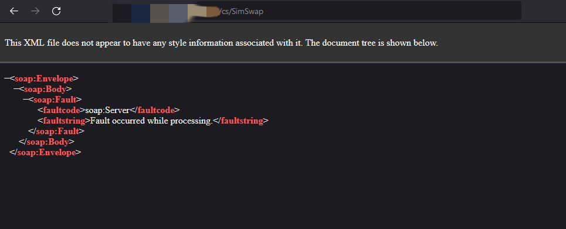
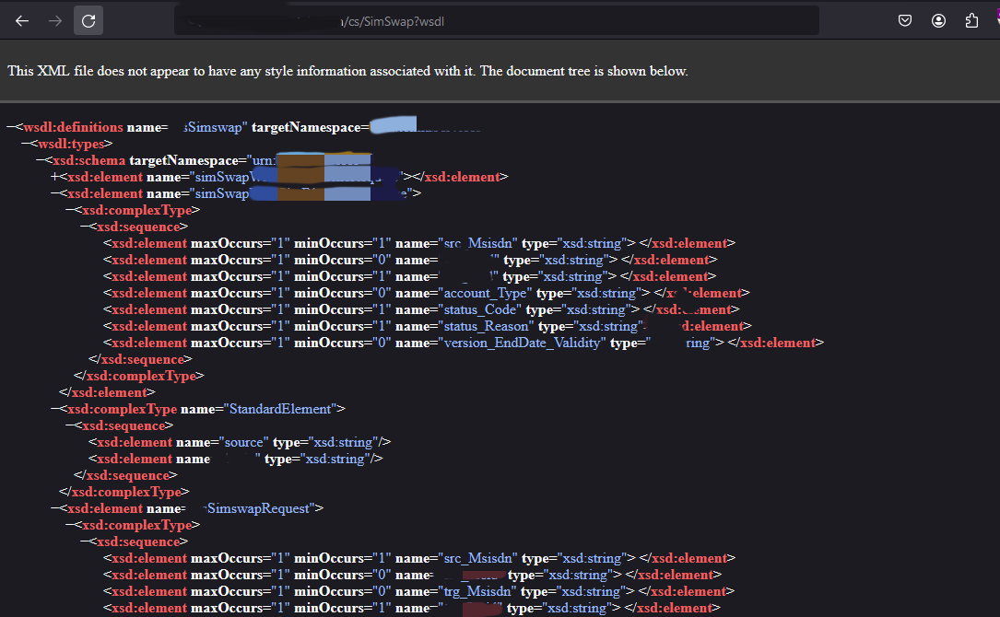
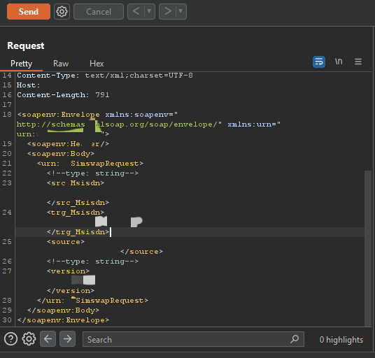

## Hacking My ISP Part 1: Exposing a Critical Bug Allowing SIM Swapping

In January 2023, I received an invitation to participate in a private bug bounty program for a popular [ISP](https://en.m.wikipedia.org/wiki/Internet_service_provider) operating in the [EMEA region](https://en.m.wikipedia.org/wiki/Europe,_the_Middle_East_and_Africa). I'm familiar with them as I use their service on a daily basis.

While gathering subdomains of redacted.com, one caught my attention: `sim-management.prod.redacted.com`. Knowing that this host is related to [SIM card](https://en.m.wikipedia.org/wiki/SIM_card) management, I asked [ChatGPT](https://chat.openai.com/) to generate a wordlist for it and used tools like [CeWL](https://github.com/digininja/CeWL), [crunch](https://sourceforge.net/p/crunch-wordlist/code/ci/master/tree/), and [WordlistGPT](https://github.com/k4l1sh/WordlistGPT).

I started directory brute-forcing using dirsearch while proxying it to Burp Suite to analyze the results using different methods like POST, PUT, etc. One directory, `/cs/`, caught my attention as it returned a content length different from the other 404 pages. (If I hadn't proxied dirsearch traffic to Burp Suite, I wouldn't have noticed this.)

Subsequently, I began brute-forcing this directory and encountered an error with `/cs/SimSwap`.

Being familiar with SOAP API, I knew that adding `?wsdl` would resolve this error.

I utilized Burp Suite's [WSDler](https://portswigger.net/bappstore/594a49bb233748f2bc80a9eb18a2e08f) extension to parse the above request.

By sending this request with the correct data, I was able to perform a SIM swap. Notably, no authentication was required for this request.

Kudos to them for promptly fixing this bug within 2 hours of my report.

Bounty: $15,000

